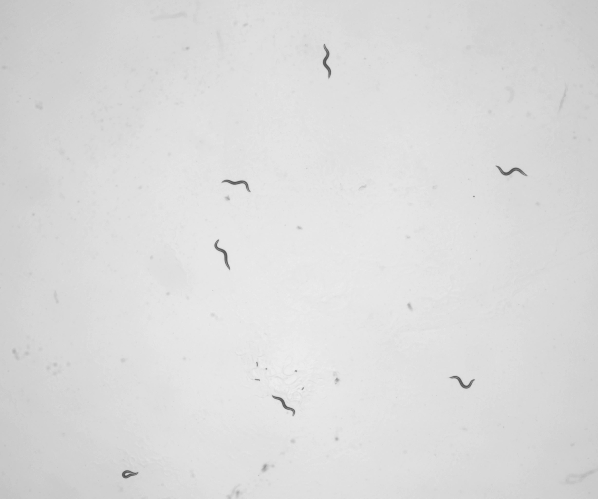
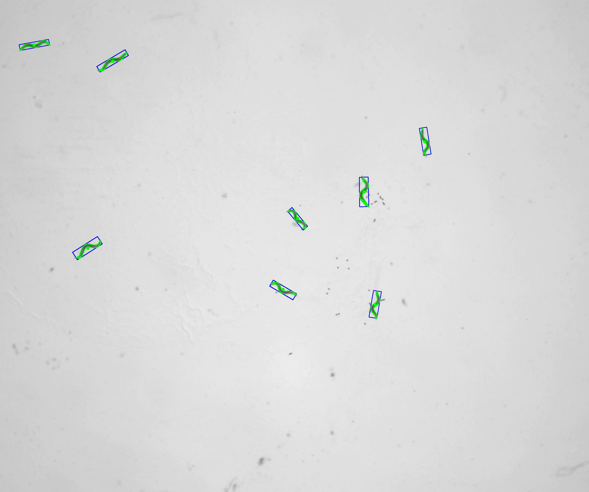
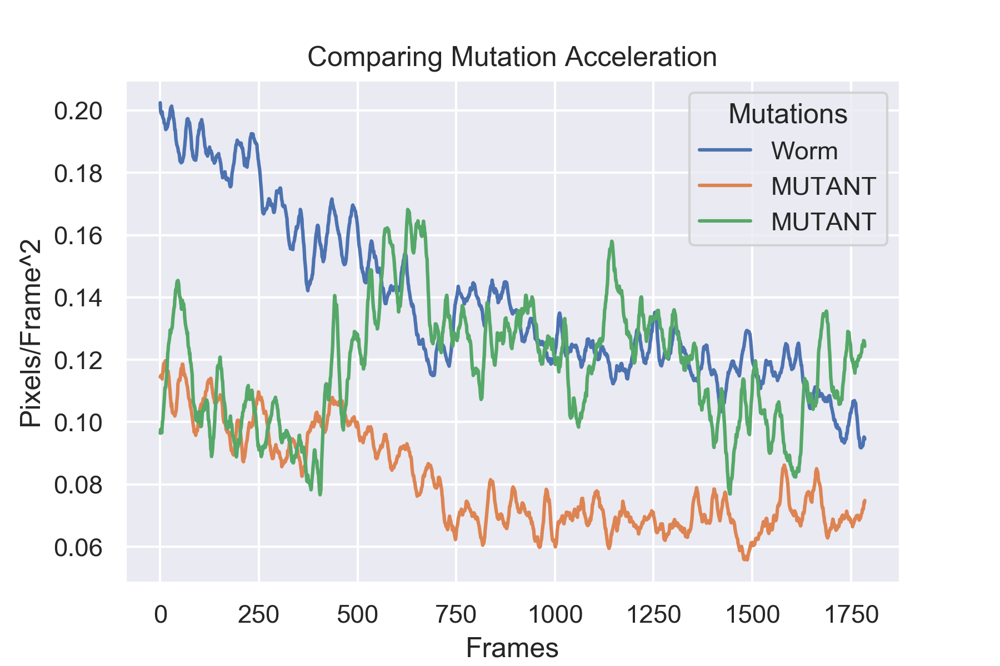

# Tracking C. Elegans: 

## Looking for Differences in Movement Between Mutations

**Some of the information regarding specific mutations has been removed until work is completed. My code is still available however**

## Problem
Current tracking system (The Multi Worm Tracker) is not confirming that which has been observed. There was seen to be a difference in movement between certain C. Elegans mutations and their normal non-mutated state (wild-type worms). This is mainly due to the current tracker looking for movement, and not the cessation of movement, which was observed. By utilizing OpenCV, Convoluted Neural Networks, Yolo and SSD object detection, and centroid tracking, I will design a worm tracker to look for cessation of movement to either confirm or deny this observation. As a secondary problem I decided I would try and predict which mutation we were given just by analyzing the video. This would be useful if a plate of worms was ever unlabeled, we could just run a video analysis on the worms to see which mutation we most likely have. This will be covered at the bottom of the readme under the section [Predicting Worms](#Predicting-Worms)

## Hypothesis Testing
Hypothesis testing is a way to verify if your hypothesis is correct or not from analyzing the data. My null hypothesis would be that there is no significance in acceleration between mutated and wild-type worms. My alternative hypothesis is that there is a statistically signifiant difference between atleast one mutation and the wild-type. This will be tested in a later step, and the results will be in the [conclusions](#Conclusions) section

## Table of Contents
[Click Here](#Contents) to be taken to the table of contents.

## Data Collection

There were 3 main stages to the data collection process. First was the filming of the videos. This was conducted by graduate students at a local university. This consisted of 77 videos about 4 minutes long each taken through a microscope of no more than 8 worms in each video. This was conducted over a period of several days, and included the three main mutations, several combinational mutations, and the wild-type worms.

Part 2 of the data collection was labeling the worms for neural network detection. First off I wrote a script ([make_photos.py](./code/scripts/make_photos.py)) which went through each video and saved a frame every 100 frames. Then using a program called LabelImg, I went through 200 of the saved frames and drew a box around each worm, saving the locations in XML files, so the worms can be found later. I did end up writing some code in [notebook 03](./code/notebooks/03_Image_Cropping_and_ImageAI.ipynb) to go through these files and crop out all the worms to save to another folder. This way I would have all the individual worms if I wanted to train a worm-image detector later. This never came into play though.

Part 3 involved collecting the locations of the worms through OpenCV in case I decided not to go the neural network route. This involved writing another script ([outlineworms.pt](./code/scripts/outlineworms.py)) which went through and using contours found and outlined all worms. The script found each worm, calculated their centroids, and drew a box around the worms. This script was later adapted into a jupyter file which logged all the centroid for each worm in a csv file. Once all the centroids were collected, the data collection phase ended.

## Data Cleaning
Data cleaning on this project was a nightmare. I thought I was coming in with some decent data, and that since it was all videos and images that there wouldn't be much cleaning. However, the farther I dug into the problem, the more it showed what was hidden. One of the main problems was getting the centroids to line up with each other. If from one frame to the next, there were the same amount of worms, there was no issue. Everything worked fine. However when a new worm entered the screen, or left the screen, then everything would switch places, and I had to un-tangle the mess. 

There were several functions which I wrote to keep track of these changes. I evaluated the data in incriments of 2 lines. If they were the same length, then no worms were added or subtracted. The possibility of a worm entering and leaving is there, however it is so statistically unlikely this would have been foolish to try and account for. Maybe in a later version this will be implimentd, but as of now there are no problems.

Next I checked to see if there were more worms in the next frame, if so then a worm has appeared. I checked the distances between all the worms in the previous frame and the current frame, and if there was a distance greater than 65, then that worm was most likely new. If not, then previously there were two worms which were merged which have split. The value 65 was chosen as larger than any one worm breaking off from clump could be, but smaller than where a worm could possibly enter the frame from. In either case, I had to reorder the worms by their closest distances. 

Finally I checked to see if there were fewer worms in the following frame. If there were then either two worms have merged or a worm has left the screen. Same as above, I checked the distances, and if there were two which were close to the same worm, then they merged. Otherwise, there was a worm which left, which I had to identify and account for. Then I resuffled the worms and attached them by their closest centers. Once this process was finished, I had cleaned the files. There are more steps that could be taken here, but this will depend by the first results I get. These will be outlined in the [future steps](#Future-Steps) section.

## Modeling Object Detection
Using the worm pictures and XML files created by LabelImg, I fed these into a YOLO (You Only Look Once) training model using ImageAI. This program takes in YOLO file, and the photos. This was an issue because I saved the files in pascal/VOC (XML), which were incompatible. I adapted a python script I found online to suit my needs to convert these XML files to YOLO ([voc_to_yolo](./code/scripts/voc_to_yolo.py)).

Once the files were converted I ran the ImageAI model using a pretrained model, but there were no C. Elegans detection in the pretrained model. This training took way too long using my CPU, and being a library it was incompatible with Google Colab and Kaggle training due to filepaths. I then contacted Joseph Nelson at Roboflow, and he gave me some advice with his software to do some more data cleaning and manipulation before passing it through a faster R-CNN network. 

Using roboflow I flipped/rotated the images, and bootstrapped more training data to get a faster and more predictable model. Using Google Colab, I trained the model for SSD, and then looped it through a video one frame at a time to see the results. Although this was the best model I have made so far, it was far from perfect as it dropped a worm a couple of times, and found one worm twice. That would have been even more of a nightmare to clean.

## Analyzing Speeds
Since I was looking for the difference as worms stop quicker, I decided it would be wise to analyze the acceleration of the worms. I needed some sort of speed guideline, so I recorded the distances between each centroid and the next frame, and then took a rolling average over 15 frames. My choice for 15 was based off the framerate of the video. The framerate was 7.5 frames a second, so the first whole number of frames per second was 15, making the math easy to convert to mm/s^2 when we manage to put a ruler under the microscope to measure that.

## Conclusions
By taking the dataframes with the rolling averages of accelerations, I took the average acceleration of each frame of the video, and turned it into a column in a new dataframe. The new dataframe ended up with each column being a mutation of worms, and the rows being each frame. I ran an ANOVA test on the whole dataframe and ended up with a p value of 0.0, which means that two or more groups are statistically significant. I then ran parallel t-tests on each mutation vs. the wild-type and ended up with significance that there was a statistcal difference between the groups. Since my p-value is low, I reject my null hypothesis and accept the alternative hypothesis. There is a statistical differene in the accelerations of mutated worms vs. the wild-type. The full statistics can be seen below.

|    |        mut |           mut |           mut |          mut |   mut |     mut |
|---:|--------------:|--------------:|-------------:|-------------:|---------:|--------:|
|  statistic | -15.7547      | 36.3994       | -6.27528     | 26.5168      |  65.9616 | 79.4925 |
|  p-value |   4.08819e-54 |  5.57497e-247 |  3.90865e-10 |  1.4203e-141 |   0      |  0      |

I have plotted some interesting statistics on top of each other. We can see that while the wild-type worm starts out more active, they slowly become more inactive as they settle down, find a nice patch of food, and start grazing. The MUTATED mutation also follows this pattern, although with much less movement throughout the video. The MUTATED mutatnt however starts off following a similar path to MUTATED, but then starts to freak out and jumps up to the level of movement that the wild-type has, which is interesting.

One Final note, the accelerations of the mutatns follow an interesting starting trend. The wild-type worm starts at about .2 pixels/frame$^2$, while the independant mutations MUTATED and MUTATED start around .11 and .9 pixels/frame$^2$ respectively. However when we combine these mutations to a MUTATED worm, we end up with a worm which is much more active and more like the wild-type at .15 pixels/frame$^2$. I am unsure why this happens, but it could be something potentially looked at in the future. When we add MUTATED mutation back in for the MUTATED mutated worm, the acceleration drops back down to where it should be at .10 pixels/frame$^2$. This can be seen in the table below:

|    |   mut |      mut |       mut |       mut |       worm |   mut |      mut |
|---:|---------:|---------:|---------:|----------:|---------:|---------:|---------:|
| 14 | 0.158452 | 0.109284 | 0.237463 | 0.0964184 | 0.202446 | 0.134538 | 0.11446  |
| 15 | 0.15862  | 0.117648 | 0.23722  | 0.0976057 | 0.199761 | 0.134861 | 0.114796 |
| 16 | 0.159974 | 0.118625 | 0.238889 | 0.0974687 | 0.199138 | 0.134912 | 0.115023 |
| 17 | 0.161882 | 0.119107 | 0.239906 | 0.097817  | 0.198829 | 0.134663 | 0.114723 |
| 18 | 0.163146 | 0.119327 | 0.239255 | 0.0965515 | 0.199258 | 0.134849 | 0.114602 |
| 19 | 0.163458 | 0.120836 | 0.240372 | 0.0987571 | 0.199544 | 0.135565 | 0.113814 |
| 20 | 0.163804 | 0.121279 | 0.239192 | 0.100311  | 0.197862 | 0.136101 | 0.115338 |
| 21 | 0.164479 | 0.121674 | 0.239792 | 0.101067  | 0.197706 | 0.135449 | 0.116463 |
| 22 | 0.164926 | 0.122377 | 0.240309 | 0.103194  | 0.197308 | 0.134901 | 0.117827 |
| 23 | 0.164125 | 0.122363 | 0.240683 | 0.104864  | 0.197094 | 0.134123 | 0.118787 |

## Future Steps
I plan to take the information I have gained through this process and apply it where given a video of some worms, I would have a model to predict which mutation the worms are, and which level of accuracy we have. This wold be a time series classification model, which I am just starting to read about. By utilizing LSTM (Long Short Term Memory), dimensionality reduction through convolutional neural networks I should be able to accomplish something that would accurately predict which worm mutation we have. 

In addition there was more data cleaning which should have been done. This included fixing some code to correctly order the centroids from one frame to the next, as an issue I am having is that when a new worm is added, I cannot account for all circumstances to re order the centroids. I went around this in the distance computation notebook where if I got an unreasonable distance (say 50 pixels in one frame), then I would know there was an error, and input a null value. This would later be changed to either the previous value, or the mean of that specific worm.

I would really like to explore finding which worms have which stats. I would like to look into worm wavelength and amplitude in order to discern differences with the mutations. As these worms move, they make little sinusoidal waves which can be measured. Worms can meander gracefully, or speed around, and it would be interesting to see if some mechanosensitively mutated worms tend to freak out more than the wild-types.

## Predicting Worms
I decided I would also try and predict which worms were on a plate due to video analysis. Since I had already done all the data cleaning, I made a a quick dataframe where each row was a specific worm with the final column in that row being the mutation. Each feature (column) was one frame in a video. This way I could track the progress of each worm individually. I modeled this with a SVM Classification model and GridsearchCV. The results varied, and I ended up with an accuracy score of 54% on the training set, and 40% on the test set. I attribute this to two different properties. First off, there was not a lot of data to model off of, there were only 360 or so rows, 25% of which went into my test set. Another reason, is that there were several mutations which were very close together, for example, the difference between MUTATED and MUTATED mutations was minimal, so even if it got those wrong the score would drop. 

I ran a version just trying to predict a given worm as being a mutation or not. This turned out much better. By changing the classes from each individual mutation, to just 1 and 0, 1 being N2 wild-type and 0 being mutated, I was able to predict the mutated worm with an accuracy score of 75% in both the train and test data. This can still be played around with, but more to come in the coming weeks.

## Contents

* code
    * notebooks
        * [01_Recording_Worm_Centers](./code/notebooks/01_Reordering_Worm_Centers.ipynb)
        * [02_Image Cropping_and_ImageAI](./code/notebooks/02_Image_Cropping_and_ImageAI.ipynb)
        * [03_Sorting_Worms](./code/notebooks/03_Sorting_Worms.ipynb)
        * [04_Getting_Distances](./code/notebooks/04_Getting_Distances.ipynb)
        * [05_Getting_Rolling_Speeds](./code/notebooks/05_Getting_Rolling_Speeds.ipynb)
        * [06_Visualizations](./code/notebooks/06_Visualizations.ipynb)
        * [07_Predicting_Worms](./code/notebooks/07_Predicting_Worms.ipynb)
    * scripts
        * [file_sorting.py](./code/notebooks/file_sorting.py)
        * [make_photos.py](./code/notebooks/make_photos.py)
        * [outlineworms.py](./code/notebooks/outlineworms.py)
        * [voc_to_yolo.py](./code/notebooks/voc_to_yolo.py)
        * [xml_to_csv.py](./code/notebooks/xml_to_csv.py)
* data
    * accelerations
    * frame_distances
    * sorted_csv
    * total_distance_values
    * worm_centers_csv
    * XML
* model
    * frozen_inference_graph.pb
* plots
    * This folder contains all graphics, photos, and gifs.
* Worm Sorting.pdf
    * My Presentation for General Assembly
    
        
